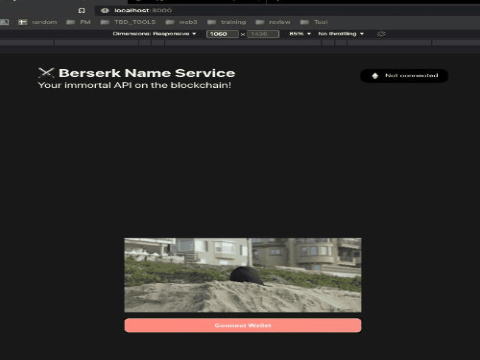

# Berserk Name Service 
## It's like ENS but with Polygon :)

Visit live demo [here](https://bns.ertyurk.com)




### **Welcome 👋**

Clone this repo and follow these commands:

1. Setup project
```sh
git clone
npm install

cp sample.env .env
```
2. test run locally
```sh
npx hardhat run scripts/run.js
```
3. Setup your alchemy api url along with Metamask private key
4. Deploy to testnet
```sh
npx hardhat run scripts/deploy.js --network mumbai
```
5. Run Run `npm run start` to start the project

